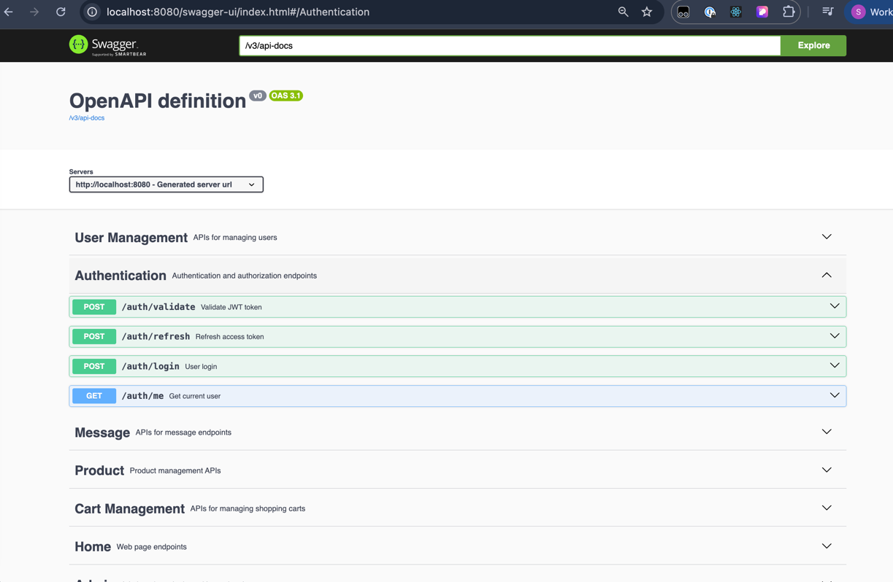

# Spring Boot Store API

This is a Spring Boot REST API project that I've built while learning Java Spring Boot
following [Code with Mosh Spring Boot tutorials](https://members.codewithmosh.com/courses).
> The primary focus is on mastering JPA, Spring Data, and Java core concepts rather than creating a fully functional
> e-commerce store. The project demonstrates modern Spring Boot development practices with database integration and
> clean
> architecture patterns.



## Table of Contents

- [Learning Focus](#learning-focus)
- [Tech Stack](#tech-stack)
- [Getting Started](#getting-started)
- [API Documentation](#api-documentation)
- [Learning Resources](#learning-resources)
- [Contact](#contact)

## Learning Focus

This project emphasizes:

- **Entity Relationships** - One-to-One, One-to-Many, Many-to-Many mappings
- **Spring Data JPA** - Repository interfaces, custom queries, and database operations
- **Dependency Injection** - Spring's IoC container and bean management
- **Configuration Management** - YAML configuration and environment variables
- **Database Integration** - MySQL setup, schema validation, and data persistence

*Note: This is a learning project focused on backend concepts rather than a production-ready e-commerce API.*

## Tech Stack

- **Java 17** - Modern Java features
- **Spring Boot 3.5.3** - Latest Spring Boot framework
- **Spring Data JPA** - Database abstraction layer
- **MySQL** - Primary database
- **H2 Database** - In-memory database for testing
- **Lombok** - Reduces boilerplate code
- **Docker** - Containerization
- **Maven** - Dependency management

## Getting Started

### Prerequisites

- Java 17
- Maven 3.6+
- Docker and Docker Compose
- MySQL (or use Docker setup)

### Quick Start with Docker

1. Clone the repository:

```bash
git clone https://github.com/sidd6p/Spring-Boot-Store-API.git
cd Spring-Boot-Store-API
```

2. Set environment variables in .env file:

```bash
MYSQL_USER=your_username
MYSQL_PASSWORD=your_password
MYSQL_ROOT_PASSWORD=your_root_password
JWT_SECRET=random_string_for_jwt
```

3. Start the services with Docker:

```bash
docker-compose up -d
```

4. Run the application:

```bash
./mvnw clean install
./mvnw spring-boot:run
```

## API Documentation

### Swagger UI

Once the application is running, you can access the interactive API documentation through Swagger UI: `http://localhost:8080/swagger-ui/index.html`

### Postman Collection

A complete Postman collection is included in the repository for testing all API endpoints: [Spring-Boot-Store-API.postman_collection.json](./Spring-Boot-Store-API.postman_collection.json)

To use the Postman collection:
1. Import the collection file into Postman
2. Set up environment variables as needed
3. Test all endpoints with pre-configured requests

## Learning Resources

This project is based on learning from:

- [Code with Mosh Spring Boot tutorials](https://members.codewithmosh.com/courses)
- [FreeCodeCamp](https://www.freecodecamp.org/)
- Spring Boot official documentation

## Contact

- **GitHub**: [@sidd6p](https://github.com/sidd6p)
- **Email**: siddpurwar@gmail.com
